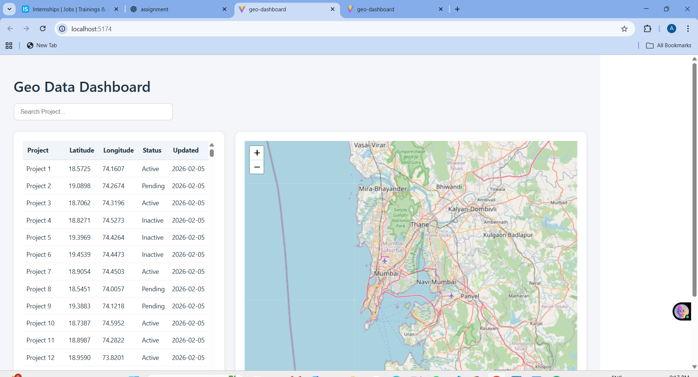
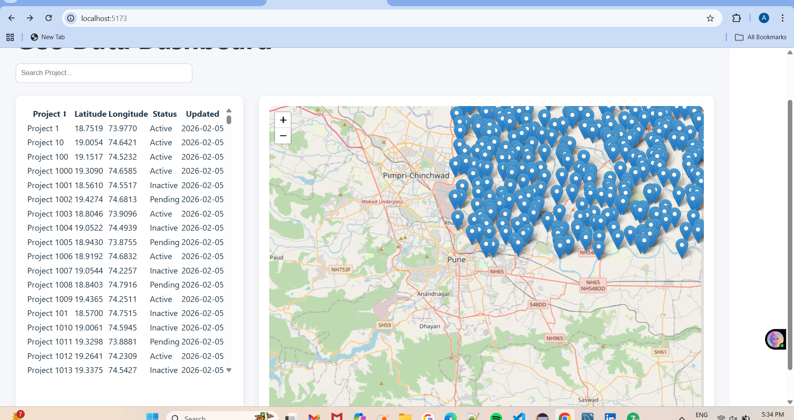

📍 Geo Data Dashboard
🚀 Overview
The Geo Data Dashboard is a React-based web application that visualizes spatial and tabular project data.
It displays project locations using an interactive map along with a synchronized data table.

The dashboard supports:
Viewing large geo datasets (5000+ records)
Searching and filtering project data
Interactive synchronization between table rows and map markers
Smooth performance with optimized rendering

🧰 Tech Stack
⚛️ React (Vite)
🪝 React Hooks
🗺️ React Leaflet (OpenStreetMap)
🎨 Custom CSS Styling
📦 JavaScript (ES6+)

📁 Project Structure
src
 ┣ components
 ┃ ┣ DataTable.jsx
 ┃ ┗ MapView.jsx
 ┣ data
 ┃ ┗ geoApi.js
 ┣ pages
 ┃ ┗ Dashboard.jsx
 ┣ App.jsx
 ┗ main.jsx

✨ Features
📊 Data Table

Displays project records in tabular format
Columns included:
Project Name
Latitude
Longitude
Status
Last Updated
Client-side search filtering
Row highlighting when selected
Scrollable table for large dataset support

🗺️ Map Integration
Built using React Leaflet
Displays project locations using map markers

Marker interactions:
Clicking a table row highlights and zooms marker
Clicking a marker highlights corresponding table row
Automatic map resizing for proper rendering
Performance optimized marker rendering

⚙️ State Management
Implemented using React Local State
Central selection state synchronizes table and map

🚀 Performance Optimization
Handles 5000+ dataset records
Marker rendering optimized by limiting visible markers
Smooth UI interaction and fast filtering

📡 Mock API
Data is generated using a mock API function:
Generates 5000 project records
Includes randomized latitude and longitude
Simulates network delay for realistic behavior

🖥️ Installation & Setup
1️⃣ Clone Repository
git clone https://github.com/archanaingle03/geo-data-dashboard.git

2️⃣ Navigate to Project
cd geo-data-dashboard

3️⃣ Install Dependencies
npm install

4️⃣ Run Development Server
npm run dev

Application will run on:

http://localhost:5173

📸 Screenshots
Dashboard View

Map & Table Synchronization

🧠 Design Decisions

Used React functional components for maintainability
Implemented reusable components for separation of concerns
Used React Leaflet due to simplicity and performance
Optimized map rendering to avoid UI lag
Used mock API to simulate real-world data fetching

⏱️ Time Spent
Task	Time
Project Setup	1 Hour
Data Table Implementation	2 Hours
Map Integration	2.5 Hours
Synchronization Logic	1.5 Hours
Performance Optimization	1 Hour
Testing & Documentation	1 Hour

Total Time: ~9 Hours
🔗 GitHub Repository
👉 https://github.com/archanaingle03/geo-data-dashboard

📌 Future Improvements
Add pagination support
Add marker clustering
Add status-based filtering
Add responsive mobile layout

👩‍💻 Author
Archana Ingle
