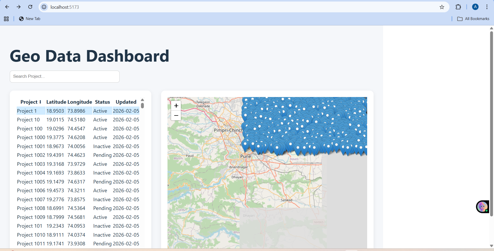

Geo Data Dashboard
📌 Overview

This project is a React-based Geo Data Dashboard that visualizes spatial and tabular data. It displays project location data in both table format and interactive map view. The dashboard supports filtering, sorting, and synchronization between table rows and map markers.

🚀 Tech Stack

React (Vite)
React Hooks
React Leaflet
OpenStreetMap
JavaScript
CSS (Custom styling)

📂 Folder Structure
src/
├── components/
│ ├── DataTable.jsx
│ ├── MapView.jsx
│
├── data/
│ ├── geoApi.js
│
├── pages/
│ ├── Dashboard.jsx
│
├── App.jsx
├── main.jsx

✨ Features Implemented
📊 Data Table

Displays project data in table format

Columns included:
Project Name
Latitude
Longitude
Status
Last Updated

Client-side search filtering
Row highlighting on selection
Optimized to handle 5000+ records smoothly

🗺 Map Integration

Built using React Leaflet
Displays markers using project latitude & longitude
Clicking table row:
Highlights marker
Zooms to location

Clicking marker:
Highlights corresponding table row

⚙ State Management

Implemented using React local state
No external state libraries used
Clean separation of UI and data logic

⚡ Performance Handling
Efficient rendering for large dataset (5000+ rows)
Lightweight filtering logic
Avoided unnecessary re-renders

📡 Data Source

Mock API simulates paginated project data.

Data structure example:

{
id: 1,
projectName: "Project 1",
latitude: 19.1234,
longitude: 73.1234,
status: "Active",
updated: "2026-02-05"
}

🧠 Key Design Decisions
Component Separation

Dashboard handles layout & state
DataTable handles table rendering
MapView handles spatial visualization

This improves maintainability and scalability.

Map Synchronization

Leaflet map requires manual resizing when layout changes.
map.invalidateSize() is used to ensure proper tile rendering.

Performance Optimization

Client-side filtering is used instead of re-fetching data.
This improves responsiveness and reduces network load.

🛠 Installation & Running Project
Step 1 — Clone Repository
git clone <https://github.com/archanaingle03>
cd geo-dashboard

Step 2 — Install Dependencies
npm install

Step 3 — Start Development Server
npm run dev

Step 4 — Open Browser
http://localhost:5173

📸 Screenshots

## Screenshots

### Dashboard Overview

### Search Filtering

### Marker Selection → Table Highlight

⏱ Time Spent
Task Time
Project Setup 1 hour
Table Implementation 2 hours
Map Integration 2 hours
Synchronization Logic 2 hours
Styling & Testing 1 hour
Total 8 hours

📌 Future Improvements

Server-side pagination
Marker clustering
Status color filtering
Mobile responsiveness improvements
Dark mode support

👩‍💻 Author
Archana Ingle
